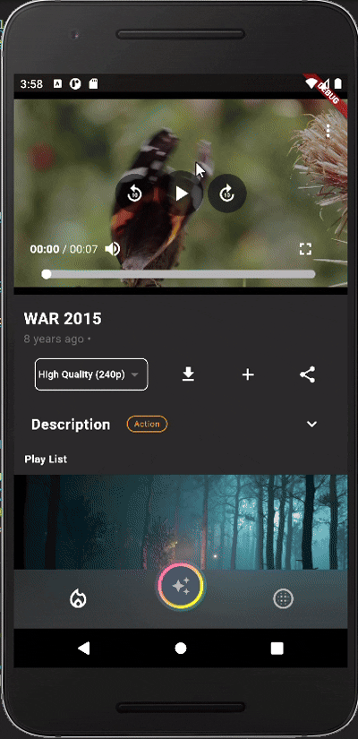
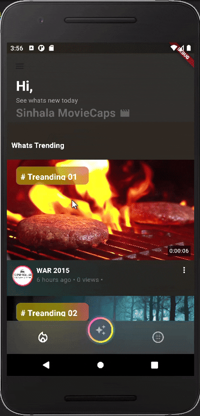
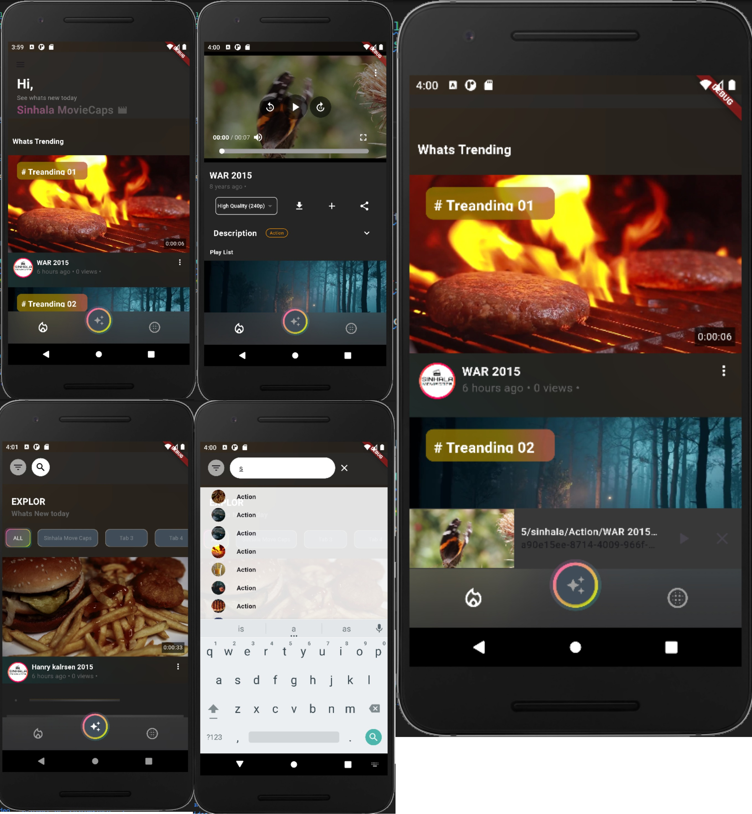

# Flutter + bunny.net Movie Streaming App

## Overview

This is a **Flutter-based movie streaming app** that allows users to stream movies and TV episodes seamlessly. The app features **quality selection**, a **YouTube mini player**, integration with **Bunny.net streaming service**, **episode display**, and **filtering options** to enhance user experience.

## Features

- 🎥 **Quality Change:** Users can switch between different video qualities while streaming content.
- 🎬 **YouTube Mini Player:** A custom YouTube-inspired mini player that allows users to continue watching while browsing other parts of the app.
- 🌐 **Bunny.net Streaming Service:** Integration with Bunny.net for fast, high-quality video streaming.
- 📺 **Episode Display:** Display a list of episodes for series and shows with a clean UI.
- 🔍 **Filter Content:** Filter movies and TV shows by genre, release date, or other criteria.

## Tech Stack

- **Flutter**: Framework used to build the app.
- **Dart**: Programming language for app development.
- **Bunny.net**: Cloud streaming service integration.
- **YouTube mini player**: Custom YouTube mini player functionality.
- **Provider/Bloc**: State management solution for Flutter.

## Screenshots

 
 
 <!-- Replace with your app screenshot -->

## Installation

### Prerequisites

Make sure you have the following installed on your machine:

- Flutter SDK: [Install Flutter](https://flutter.dev/docs/get-started/install)
- Dart SDK: [Install Dart](https://dart.dev/get-dart)

### Steps to Install

1. Clone the repository:
   ```bash
   git clone https://github.com/your-username/flutter_movie_streaming_app.git
